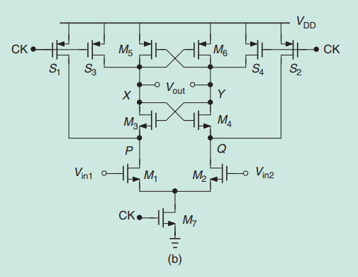
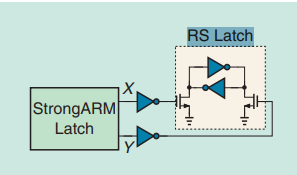
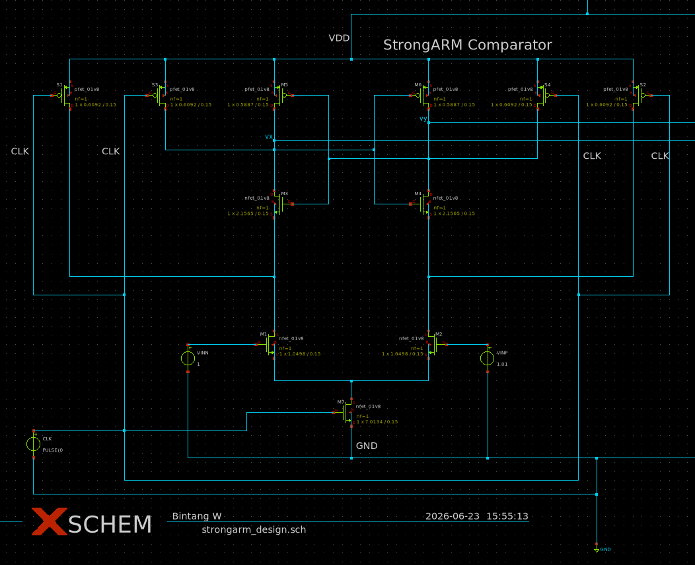
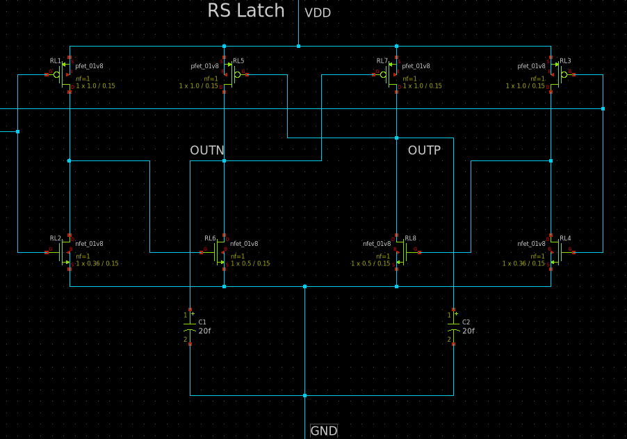
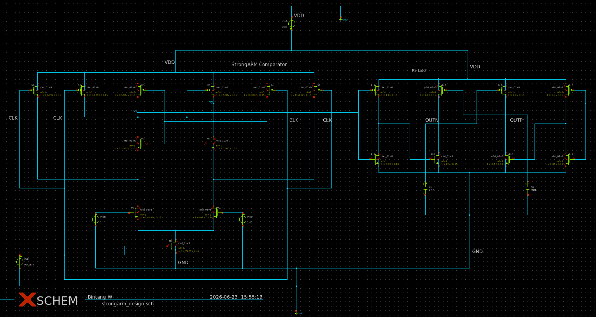
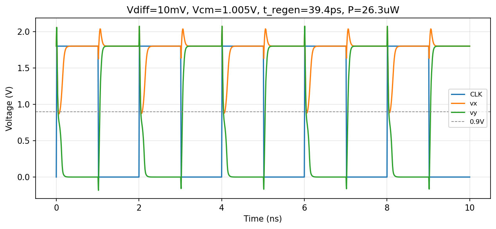
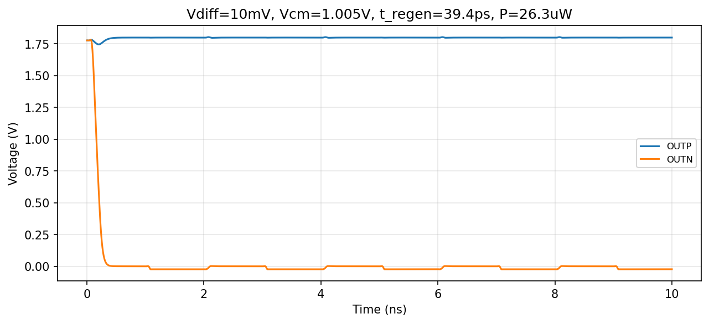
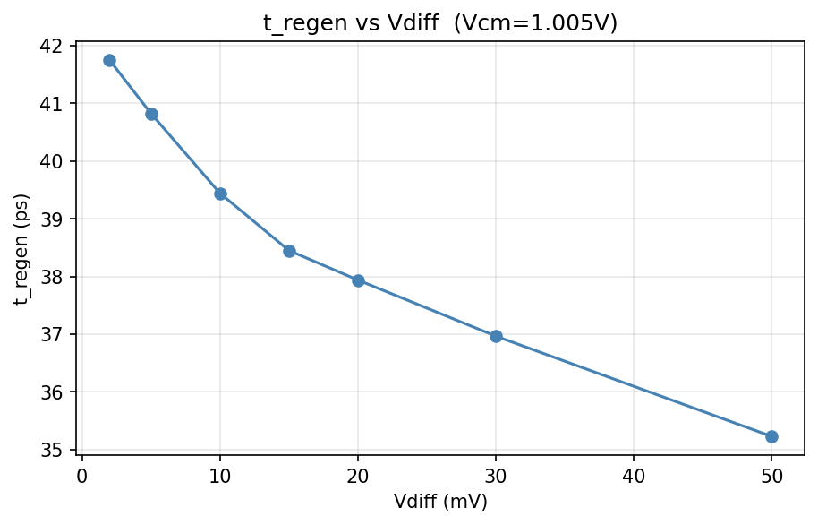
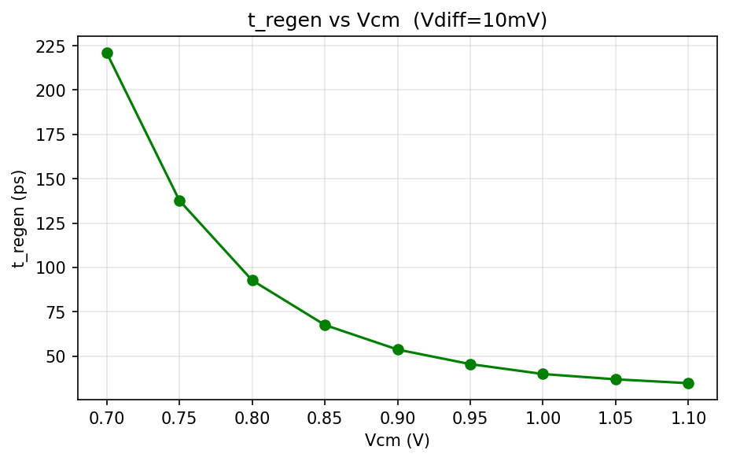

# Optimizing StrongARM Comparator Sizing using Python and Ngspice on sky130A

## Overview

A Successive Approximation Register (SAR) ADC converts an analog input into a digital code by performing a binary search over N clock cycles. At each cycle, a comparator decides whether the residue voltage is above or below a DAC reference, and the SAR logic updates the digital code accordingly. The comparator is the core decision element, and its speed and power directly determine the ADC's overall performance.

The StrongARM latch is the dominant comparator topology in modern SAR ADCs. It consumes zero static power, produces full swing rail to rail outputs, requires only a single clock phase, and achieves high regeneration speed. An SR latch is added at the output to hold the comparison result during the precharge phase, preventing the decision from being lost before the SAR logic can sample it.

This project combines analog circuit design with Python automation. The schematic is captured in xschem and simulated with ngspice on the SkyWater sky130A 180 nm open source PDK. Python scripts drive the entire optimization and characterization flow. These scripts inject transistor width values into the netlist, invoke ngspice in batch mode, parse simulation output, and feed results into two optimization algorithms (Differential Evolution and Bayesian Optimization) to find the transistor sizing that minimizes **FoM = t_regen x Power**. After optimization, a separate characterization script sweeps input differential voltage and common mode voltage to evaluate comparator performance across operating conditions

---

## Reference Design

The circuit topology is based on:

> B. Razavi, "The StrongARM Latch," _IEEE Solid-State Circuits Magazine_, vol. 7, no. 2, pp. 12-17, Spring 2015.

|                           |                                       |
| :-----------------------------------------------------: | :------------------------------------------------------------: |
| _(a) StrongARM latch core topology from Razavi (2015)._ | _(b) Full comparator circuit including SR latch output stage._ |

---

## Specifications

| Parameter                  | Value                     |
| -------------------------- | ------------------------- |
| Technology                 | SkyWater sky130A (180 nm) |
| Supply voltage (VDD)       | 1.8 V                     |
| Clock frequency            | 500 MHz                   |
| Input common-mode (Vcm)    | 1.005 V (baseline)        |
| Input differential (Vdiff) | 10 mV (baseline)          |
| Figure of Merit (FoM)      | t_regen x Power           |

---

## Tools

| Tool                                                           | Role                                                  |
| -------------------------------------------------------------- | ----------------------------------------------------- |
| [xschem](https://xschem.sourceforge.io)                        | Schematic capture and netlist export                  |
| [ngspice](https://ngspice.sourceforge.io)                      | SPICE simulation engine                               |
| [SkyWater sky130A PDK](https://github.com/google/skywater-pdk) | 180 nm process design kit                             |
| Python 3                                                       | Optimization and characterization scripting           |
| [SciPy](https://scipy.org) `differential_evolution`            | Global optimizer (Differential Evolution)             |
| [Optuna](https://optuna.org) TPE sampler                       | Bayesian optimizer (Tree-structured Parzen Estimator) |

---

## Design Flow

Each ngspice run evaluates one transistor sizing point. The Python scripts inject W values into the netlist template, run ngspice, parse `.measure` output for `t_regen` and `pwr_avg`, and compute FoM. The optimizer iterates until convergence or the trial budget is reached.

---

## Circuit Design

### Comparator Core (StrongARM Latch)

### RS Latch Output Stage

### Full Design

_Complete comparator schematic including the StrongARM latch core and RS latch output stage._

---

## Optimization

Two methods were compared, both minimizing **FoM = t_regen x Power**:

### Differential Evolution (SciPy)

- Population size: 8 x 5 = 40 per generation
- Generations: 5
- Total evaluations: ~200 ngspice runs
- Runtime: ~49 min

### Bayesian Optimization (Optuna TPE)

- Trials: 80
- Valid trials: 69 / 80
- Runtime: ~16 min

### Results

| Method                 | t_regen     | Power       | FoM            |
| ---------------------- | ----------- | ----------- | -------------- |
| Differential Evolution | 38.0 ps     | 28.9 uW     | 1098 ps.uW     |
| **Bayesian (best)**    | **39.4 ps** | **26.3 uW** | **1037 ps.uW** |

Bayesian optimization achieved a lower FoM in approximately 3x less time than DE. TPE builds a probabilistic model of the objective surface after initial random trials, allowing it to target promising regions efficiently. This is a significant advantage when each evaluation takes around 10 seconds per ngspice run.

**Optimal sizing (Bayesian):**

| Parameter | Value     |
| --------- | --------- |
| WN_IN     | 2.2863 um |
| WN_LAT    | 0.7061 um |
| WP_LAT    | 0.4360 um |
| WN_TAIL   | 6.5324 um |
| WP_RST    | 0.5329 um |

---

## Characterization Results

All sweeps use the Bayesian optimal sizing.

### Baseline operating point

- **t_regen = 39.4 ps**
- **Power = 26.3 uW**
- **FoM = 1037.1 ps.uW**

### Waveform Analysis

When CLK rises, the tail switch turns on and the internal nodes vx and vy begin to discharge. Since VINP > VINN, the VINP side discharges faster, causing vy to fall while vx is pulled back up by the cross coupled latch. Once vy crosses 0.9 V (VDD/2), the SR latch sets OUTP HIGH and OUTN LOW. When CLK falls, vx and vy reset to VDD but the SR latch holds the output, preserving the comparison result through the next precharge phase.

### Vdiff sweep (Vcm = 1.005 V)

| Vdiff | t_regen |
| ----- | ------- |
| 2 mV  | 41.7 ps |
| 5 mV  | 40.8 ps |
| 10 mV | 39.4 ps |
| 15 mV | 38.4 ps |
| 20 mV | 37.9 ps |
| 30 mV | 37.0 ps |
| 50 mV | 35.2 ps |

### Vcm sweep (Vdiff = 10 mV)

| Vcm    | t_regen  |
| ------ | -------- |
| 0.70 V | 221.0 ps |
| 0.75 V | 137.8 ps |
| 0.80 V | 92.8 ps  |
| 0.85 V | 67.6 ps  |
| 0.90 V | 53.8 ps  |
| 0.95 V | 45.6 ps  |
| 1.00 V | 40.0 ps  |
| 1.05 V | 37.0 ps  |
| 1.10 V | 34.8 ps  |

### Worst case corner (Vdiff = 1 mV, Vcm = 0.7 V)

| Parameter | Value |
| --------- | ----- |
| t_regen   | 347.6 ps |
| Power     | 30.8 uW |
| FoM       | 10700.8 ps.uW |

Even at the worst case corner, t_regen = 347.6 ps is well below the 1 ns available before the clock falls again (500 MHz, half period = 1 ns), confirming correct operation down to 1 mV differential input.

---

## Author

Bintang W
